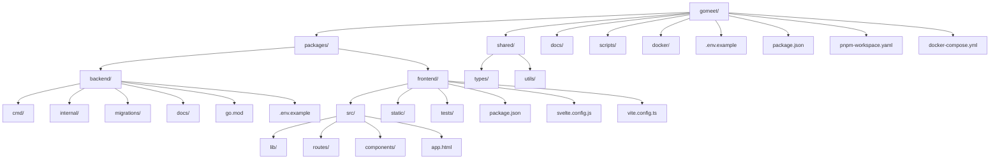
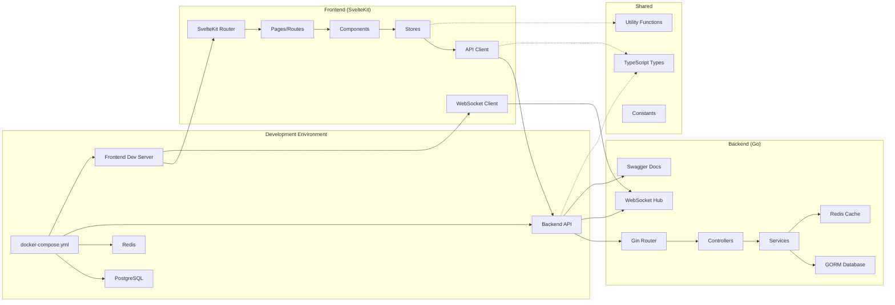
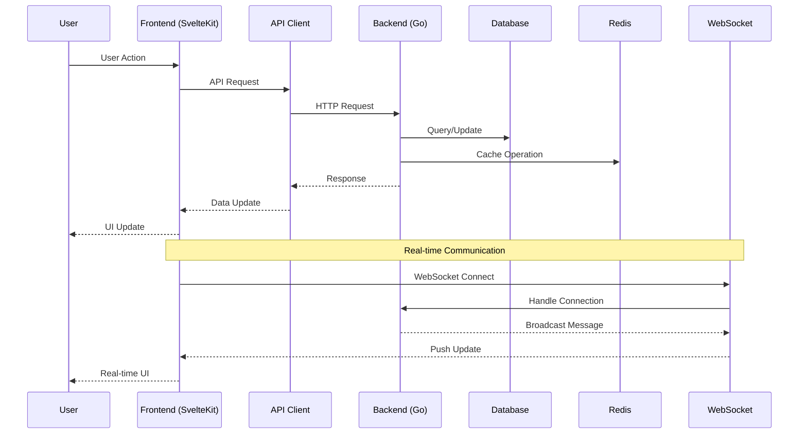
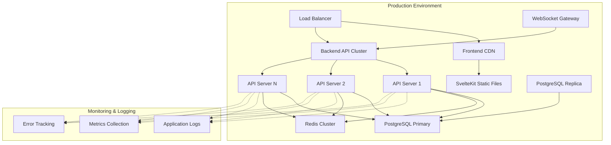
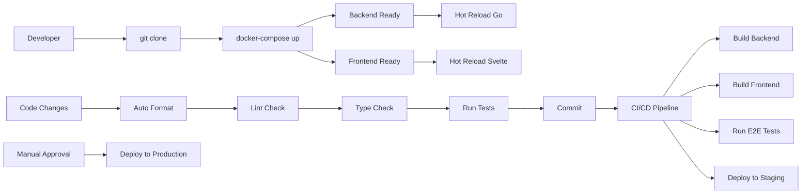
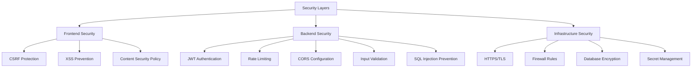
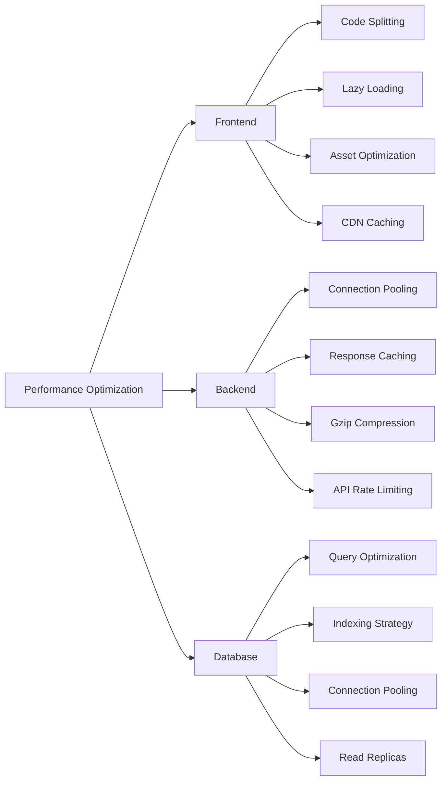

# Diagram Arsitektur Baru GoMeet

## Visualisasi Struktur Folder



## Arsitektur High-Level



## Flow Data Aplikasi



## Component Architecture

```mermaid
graph TD
    subgraph "Frontend Components (Svelte)"
        A[Layout Components] --> B[Header.svelte]
        A --> C[Sidebar.svelte]
        A --> D[Footer.svelte]

        E[UI Components] --> F[Button.svelte]
        E --> G[Input.svelte]
        E --> H[Modal.svelte]
        E --> I[Card.svelte]

        J[Feature Components] --> K[MeetingCard.svelte]
        J --> L[ChatPanel.svelte]
        J --> M[VideoGrid.svelte]
        J --> N[ParticipantList.svelte]

        O[Page Components] --> P[Dashboard.svelte]
        O --> Q[Meeting/[id].svelte]
        O --> R[Auth.svelte]
    end

    subgraph "Backend Services (Go)"
        S[Auth Service] --> T[JWT Management]
        S --> U[User Validation]

        V[Meeting Service] --> W[CRUD Operations]
        V --> X[Participant Management]

        Y[Chat Service] --> Z[Message Handling]
        Y --> AA[Real-time Updates]

        BB[WebSocket Service] --> CC[Connection Management]
        BB --> DD[Message Broadcasting]
    end
```

## Deployment Architecture



## Development Workflow



## Technology Stack

```mermaid
graph TD
    A[GoMeet Application] --> B[Frontend]
    A --> C[Backend]
    A --> D[Infrastructure]

    B --> E[SvelteKit]
    B --> F[TypeScript]
    B --> G[Tailwind CSS]
    B --> H[Vite]

    C --> I[Go 1.24]
    C --> J[Gin Framework]
    C --> K[GORM]
    C --> L[WebSocket]

    D --> M[PostgreSQL]
    D --> N[Redis]
    D --> O[Docker]
    D --> P[Nginx]

    Q[Development Tools] --> R[PNPM Workspaces]
    Q --> S[Air (Go Hot Reload)]
    Q --> T[ESLint]
    Q --> U[Prettier]
```

## Security Architecture



## Performance Considerations



## Migration Strategy

```mermaid
graph TD
    A[Migration Phases] --> B[Phase 1: Setup]
    A --> C[Phase 2: Backend]
    A --> D[Phase 3: Frontend]
    A --> E[Phase 4: Integration]
    A --> F[Phase 5: Testing]
    A --> G[Phase 6: Deployment]

    B --> H[Create Structure]
    B --> I[Setup Workspace]
    B --> J[Move Backend]

    C --> K[Update Imports]
    C --> L[Fix CORS]
    C --> M[Test APIs]

    D --> N[Setup SvelteKit]
    D --> O[Migrate Components]
    D --> P[Convert Hooks]

    E --> Q[API Integration]
    E --> R[WebSocket Setup]
    E --> S[Type Sharing]

    F --> T[Unit Tests]
    F --> U[Integration Tests]
    F --> V[E2E Tests]

    G --> W[Staging Deploy]
    G --> X[Production Deploy]
    G --> Y[Monitor & Optimize]
```


